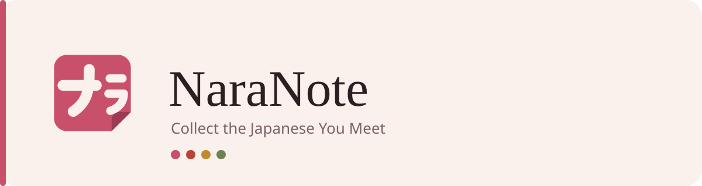

Anki is very good at reviewing flashcards and quite bad at making them. Looking a word up,
finding a sentence it lives in, typing it all into a card — it's slow enough that most people
just don't, and the word gets forgotten instead. NaraNote is the other half of that: the part
where you collect what you meet, so reviewing it later is easy.

## What You Do With It

**Look up any kanji.** Readings, meanings, stroke count, JLPT level, and a stroke-order diagram
with every stroke numbered. Each character also shows what it's built from, and those components
link onward — so 待 opens into 彳, 土 and 寸, and you can take a character apart.

**Keep the ones you care about.** Add characters to your collection as you meet them. It's
yours, not a fixed syllabus, so it grows out of what you actually read.

**Practise writing by hand.** You're shown a meaning and its readings; you draw the character
from memory. Then the real one appears with every stroke numbered, so you can see not just
whether you got it right but exactly where your stroke order went wrong. Flashcard apps can't
check handwriting — you have to mark yourself, and marking yourself is how bad habits set in.

**Come back at the right time.** How you rate each attempt decides when that character returns,
using the same scheduling algorithm Anki uses. Only handwriting is scheduled here; vocabulary
belongs in Anki, which does it better.

**See what you actually did.** The home page is a calendar that fills itself in — characters
drawn, characters added — with no streaks and nothing carried forward. Beside it sits a short
list of what's worth doing right now, worked out from your own collection rather than typed in
by you. You can add your own tasks too, and give them a day or a character so they land on the
calendar and can start a practice session.

## Coming

**Sentence mining.** Paste in Japanese from anywhere — a manga page, a news article, subtitles,
a class handout — and get it back split into words with readings and meanings. Words you've
already saved appear dimmed, so any text quietly shows you how much of it you know.

**Export to Anki.** Everything you collect becomes a deck. NaraNote doesn't try to replace
Anki's reviewing; it just makes the cards worth reviewing.

## Status

Early development. Kanji lookup, the collection, handwriting practice and the home page work.
There are no accounts yet, so it runs for one person on one machine.

---

Dictionary data from [KANJIDIC2](https://www.edrdg.org/wiki/index.php/KANJIDIC_Project) and
KRADFILE (EDRDG, CC BY-SA). Stroke-order diagrams from
[KanjiVG](https://kanjivg.tagaini.net/) © Ulrich Apel, CC BY-SA 3.0.

Building on this? See [docs/development.md](docs/development.md).
